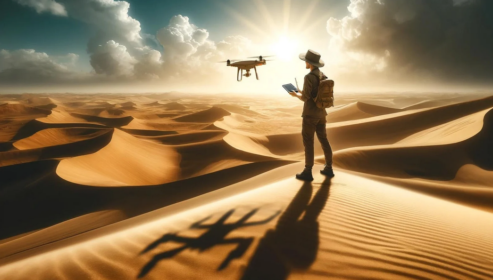

# VR Survival in the Desert

  

 

   

## Introduction

**VR Survival in the Desert** est un projet de jeu en réalité virtuelle développé par Steeve Rabehanta, Charles Batchaev, et Ait Taouit Yanis sous la supervision de M. Badr Tajini à ESIEE Paris pour l'année académique 2023-2024. Ce jeu combine exploration, survie et interactivité dans un environnement de désert virtuel.

## Installation

Pour installer et lancer le jeu, suivez ces étapes :

1. Assurez-vous d'avoir un casque VR compatible, tel que Oculus Meta Quest 2 ou 3.
2. Clonez le dépôt.
3. Ouvrez le projet avec Unity (version recommandée : 2022.3.22f).
4. Compilez et lancez le projet sur votre dispositif VR.

## Gameplay

Le joueur commence isolé dans un désert virtuel et doit survivre en explorant son environnement. Les points clés du gameplay incluent :

- **Exploration** : Découverte de pyramides et autres éléments cachés dans le désert.
- **Survie** : Gestion de la fatigue et des ressources.
- **Interactivité** : Utilisation d'un drone pour explorer des zones inaccessibles à pied.

## Caractéristiques Techniques

- **Moteur de jeu** : Unity
- **Plateformes supportées** : Oculus Meta Quest 2/3
- **APIs utilisées** : OpenXR, Oculus SDK

## Problèmes connus et solutions

- **Optimisation pour VR** : Des problèmes d'optimisation ont nécessité la désactivation temporaire d'OpenXR. Utilisez Oculus SDK pour des performances optimisées.

## Contributeurs

- **Charles Batchaev** - Développeur principal et artiste du jeu.
- **Steeve Rabehanta** - Chef de projet et développeur.
- **Ait Taouit Yanis** - Développeur et artiste du jeu.

## Remerciements

Nous tenons à remercier M. Badr Tajini pour son encadrement tout au long du projet, ainsi que tous ceux qui ont contribué à tester et améliorer le jeu.

## Licence

Ce projet est sous licence XYZ. Voir le fichier `LICENSE` pour plus de détails.
